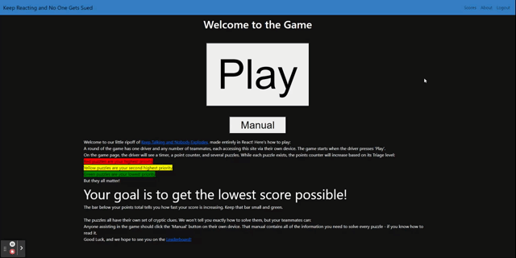
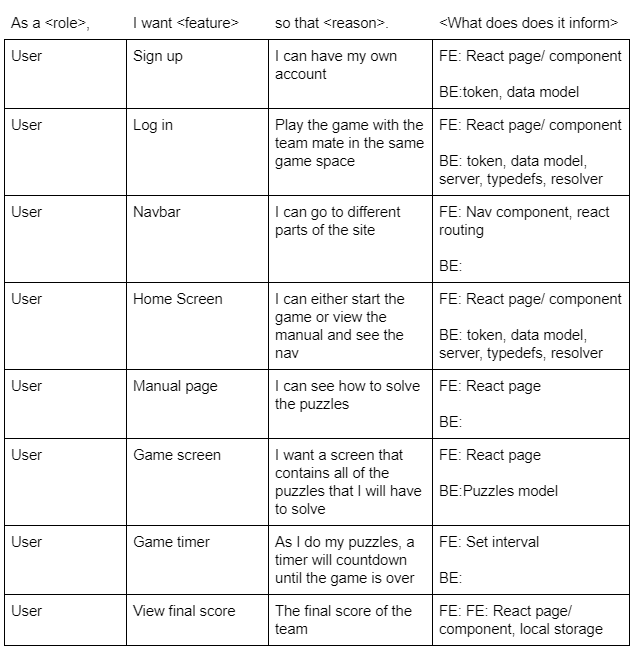
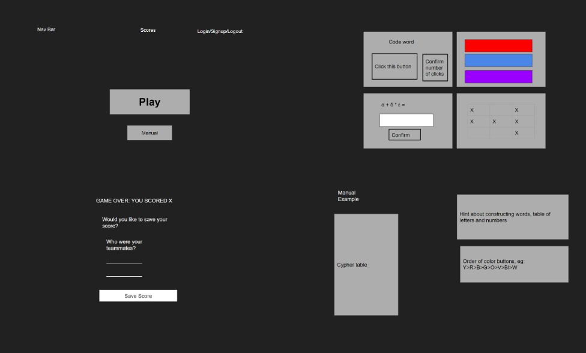

# Keep Reacting and No One Gets Sued
​

## Technology Used
| Technology Used |                 Resource URL                 |
| --------------- | :------------------------------------------: |
| Git             | [https://git-scm.com/](https://git-scm.com/) |
| React           |  [https://react.dev/](https://react.dev/)  |
| JavaScript | [https://www.javascript.com/learn](https://www.javascript.com/learn)  |
| Node  | [https://nodejs.org/en/about](https://nodejs.org/en/about)   |
| MongoDB  | [https://www.mongodb.com/docs/](https://www.mongodb.com/docs/)  |
| Vite  | [https://vitejs.dev/](https://vitejs.dev/)  |
| React Bootstrap          |  [https://react-bootstrap.netlify.app/docs/getting-started/introduction](https://react-bootstrap.netlify.app/docs/getting-started/introduction)  |
| Apollo Server | [https://www.apollographql.com/docs/apollo-server/](https://www.apollographql.com/docs/apollo-server/) |
|  Express |  [https://expressjs.com/en/guide/routing.html](https://expressjs.com/en/guide/routing.html)  |
|  Random-seed | [https://www.npmjs.com/package/random-seed](https://www.npmjs.com/package/random-seed) | 
| Framer-motion  | [https://www.framer.com/motion/](https://www.framer.com/motion/)  |

## Description
​
This is an interactive, cooperative game that is built with React. 

[Deployed link](https://evening-chamber-43103-8afc86137a8c.herokuapp.com)
​
## User Stories


## Wireframe


## Code Highlight

```Javascript (Components)
const Login = () => {
  const [userFormData, setUserFormData] = useState({ email: '', password: '' });
  const [validated] = useState(false);
  const [showAlert, setShowAlert] = useState(false);
​
  const [login, {loading }] = useMutation(LOGIN_USER);
​
  //Update value of input
  const handleInputChange = (event) => {
    const { name, value } = event.target;
    setUserFormData({ ...userFormData, [name]: value });
  };
​
  //Subit Form
  const handleFormSubmit = async (event) => {
    event.preventDefault();
​
    const form = event.currentTarget;
    if (form.checkValidity() === false) {
      event.preventDefault();
      event.stopPropagation();
    }
​
    try {
      const { data } = await login({
        variables: { ...userFormData }
      });
      //Check if data was retrieved
      if (!data) {
        throw new Error('something went wrong!');
      }
​
      Auth.login(data.login.token);
      console.log(data)
    } catch (err) {
      console.error(err);
      setShowAlert(true);
    }
​
    setUserFormData({
      email: '',
      password: '',
    });
  };
};
```
This code demonstrates the utilization of JavaScript webtoken for user authentication when logging in
​
## Usage
​The user can create an account or login if they already have an account to start playing the game. There is one player who will solve puzzles and another person who will guide the player. The player will click the play button and the guide will click the manual button. The player will the solve random puzzles with the help of the guide to get the lowest score they can. Once the game is finished, the player can submit their score to the leaderboard.

## Learning Points
* Full-Stack MERN application
* Team Gitflow
* New technologies (Random-seed and Framer-motion)
* Game Design
* Deploying to Heroku with MongoDB
​
## Author Info
### Xiaoran Cai
- [Github](https://github.com/Aillycxr)
- [LinkedIn](https://www.linkedin.com/in/xrcai/)

### Timothy Su
- [Github](https://github.com/timothysu1)
- [LinkedIn](https://www.linkedin.com/in/timothysu1/)

### Derek Stanley-Howarth
- [Github](https://github.com/DSHowarth)
- [LinkedIn](https://www.linkedin.com/in/derek-stanley-howarth-933a46106/)​

## Credits
- W3schools: [https://www.w3schools.com](https://www.w3schools.com)
​
## License
Copyright (c). All rights reserved.
Licensed under the [MIT](https://choosealicense.com/licenses/mit/) license.